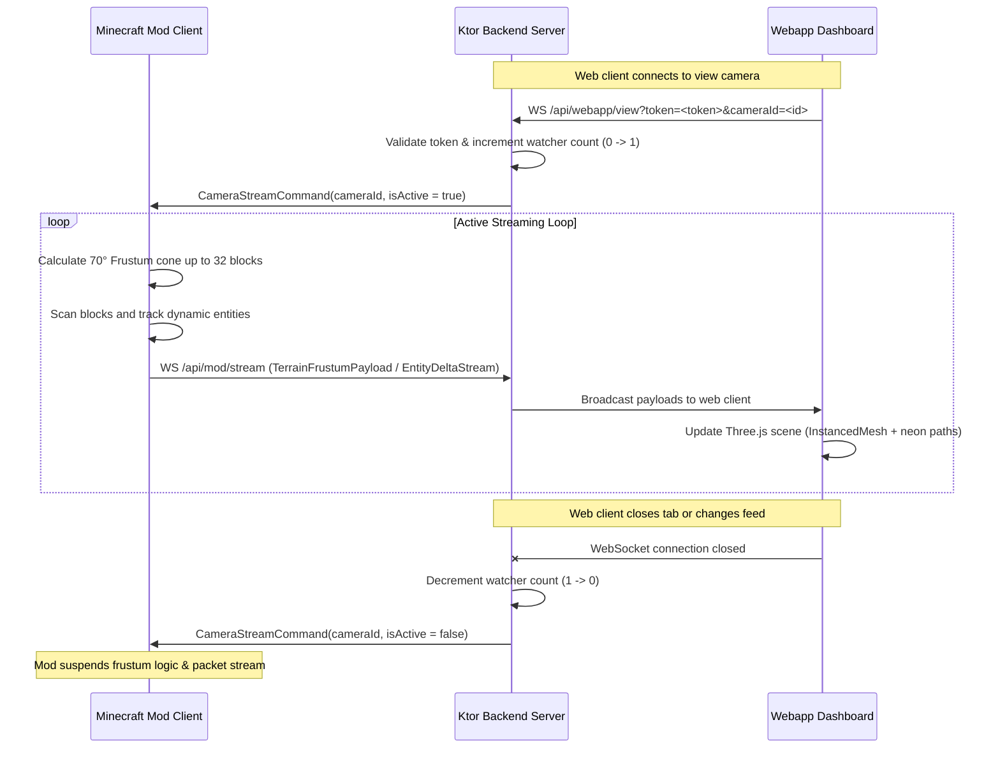

# CRT-angarine

A full-stack, real-time surveillance network system that streams live voxel environment matrices and entity coordinates from a **Minecraft** world to an immersive, retro **CRT surveillance dashboard** in your web browser.

Built with a Kotlin multi-project architecture (Ktor, WebSockets, NeoForge) and a Vite + React + Three.js frontend.

### Version Compatibility

| Mod Version | Minecraft Version | Loader / Platform | Java Version | Status |
| :--- | :--- | :--- | :--- | :--- |
| **`1.0.x`** | `1.21.1` | NeoForge (21.1.234+) | JDK 21 | Active / Stable |

## Quick Start Guide

To run the surveillance network system, you will need to set up both the webserver and the Minecraft client mod.

### 1. Webserver Setup
The webserver runs the backend database and serves the CRT browser dashboard.

1. Go to the Releases page and download the latest `crtangarine-webserver-v*.zip` package.
2. Extract the ZIP file to a folder on your computer.
3. Launch the webserver:
   * Windows: Double-click `start.bat`.
   * Linux / macOS: Run `./start.sh` in your terminal.
   *(Note: This webserver requires Java 21. If Java is not detected, the startup script will open a link to download it.)*
4. Open your browser and go to `http://localhost:8080` to access the surveillance matrix dashboard.

### 2. Minecraft Client Setup
1. Download the latest `crtangarine-mod-*.jar` file from the Releases page.
2. Place the JAR file inside your Minecraft client's `mods` folder.
3. Launch Minecraft 1.21.1 using the NeoForge mod loader.
4. Once in-game, place down a Camera Station and use a Security Keycard to configure your camera feed and link it to the webserver.

---

## System Architecture & Modules

The project is structured as a Kotlin-based Gradle multi-project, with a React+TypeScript web application inside the root.

```
CRT-angarine/
├── shared/             # Kotlin multiplatform-like library (shared models, serializable packets)
├── backend/            # Kotlin Ktor Server (Netty, WebSockets, HTTP API, static resources router)
├── mod/                # Kotlin NeoForge Minecraft Mod (Client-side camera data collection, Aim controls)
└── webapp/             # Vite + React + Three.js CRT surveillance matrix frontend
```

### 1. [Shared](shared) Module
Contains shared data models annotated with `@Serializable` for communication between the Minecraft mod, backend server, and the webapp.
* **Key Files:**
  * [Packets.kt](shared/src/main/kotlin/me/orange/crtangarine/shared/Packets.kt): Sealed class hierarchy representing message envelopes, containing `AuthTokenPacket`, `TerrainFrustumPayload`, `EntityDeltaStream`, `CameraStreamCommand`, and the wrapper `ModMessage`.
  * [CameraData.kt](shared/src/main/kotlin/me/orange/crtangarine/shared/CameraData.kt): Data transfer structures like `CameraData`, `CameraInfo`, `StationInfo`, and `CameraRegistryUpdate`.
* **Obfuscation Utility:** `CryptoUtils` uses a fast XOR-based cipher token to mask player credentials before writing to the local flat-file storage.

### 2. [Backend](backend) Module
A Ktor Server powered by Netty that acts as the messaging broker and static file server.
* **Network Port:** Runs on port `8080` (configured in `application.yaml`).
* **Static Assets Server:** Serves compiled React assets from the `webapp/dist` folder using single-page application (SPA) fallback routing.
* **API Endpoints:**
  * `POST /api/login`: Validates the token provided by the webapp dashboard.
  * `POST /api/register-token`: Registers player UUID and encrypted token (invoked by the Minecraft mod).
  * `GET /api/cameras`: Returns all cameras associated with a user's token.
* **WebSocket Routes:**
  * `/api/mod/stream`: Connection endpoint for the Minecraft mod to stream `RegistryUpdateMessage`, `FrustumPayloadMessage`, and `EntityStreamMessage` (handled in [Websockets.kt](file:///C:/Users/Marcos/Documents/Dev/CRT-angarine/backend/src/main/kotlin/Websockets.kt)).
  * `/api/webapp/view`: Connection endpoint for the web dashboard. Receives camera subscriptions and forwards live frustum payloads and entity streams.
* **Storage:** Manages a flat-file JSON database (`auth_tokens.json`) via [TokenRegistry.kt](file:///C:/Users/Marcos/Documents/Dev/CRT-angarine/backend/src/main/kotlin/TokenRegistry.kt).

### 3. [Mod](mod) Module
A Minecraft 1.21.1 NeoForge mod using Kotlin. Connects to the Ktor server as a Ktor client to stream data and register players.
* **Core Registrations:**
  * **Blocks:** `Camera Block` (with rotation blockstate parameters) and `Camera Station Block` (holding owner UUID and station name) registered via [ModBlocks.kt](file:///C:/Users/Marcos/Documents/Dev/CRT-angarine/mod/src/main/kotlin/me/orange/crtangarine/block/ModBlocks.kt).
  * **Items:** `Security Keycard Item` (stores the player profile UUID).
* **Key Mechanisms:**
  * **Station Identity Binding:** Burning player identity from a `Security Keycard` into the station block entity.
  * **Camera Aiming Pipeline:** Fired from the Station UI. Temporarily possesses player camera view, binds rotation pitch/yaw values to camera blocks, and safely restores player control.
  * **Surveillance Frustum Cone Math:** Streams blocks and entities within a 70-degree frustum up to 32 blocks away *only* when the backend signals `isActive = true`. Managed client-side by [CameraStreamingClient.kt](file:///C:/Users/Marcos/Documents/Dev/CRT-angarine/mod/src/main/kotlin/me/orange/crtangarine/network/CameraStreamingClient.kt).

### 4. [Webapp](webapp) Module
A React dashboard built using raw Three.js rendering techniques to display environment grids and track entities in a retro neon/CRT scanline shader interface.
* **Production Deployment:** This module compiles into a highly optimized, single-page application static bundle via Vite, which is automatically ingested and served by the `backend` module.

---

## Protocol & Live Streaming Lifecycle



---

## Configurations & System Constants

### 1. Surveillance Math & Frustum Parameters
* **Field of View (FOV):** 70-degree horizontal and vertical projection cone.
* **Maximum Range:** 32-block radius from the camera coordinates.
* **Static Block Classification IDs:**
  | ID | Category | Examples / Representation in Webapp |
  |----|----------|-------------------------------------|
  | `0` | Air / Passable | Transparent (not rendered) |
  | `1` | Solid Obstacle | Translucent Voxel Mesh |
  | `2` | Hazard | Red glowing block (Lava / Fire) |
  | `3` | Interactable | Yellow wireframe (Doors / Buttons / Chests) |

### 2. Entity Radar Mappings
Dynamic entity coordinates are tracked and color-coded within the Three.js viewport:
* **PLAYER** -> 🔵 **Electric Blue**
* **MONSTER** -> 🔴 **Crimson Red**
* **PASSIVE** -> 🟢 **Matrix Green**
* **ITEM** -> 🟡 **Amber Yellow**

> Every tracked entity node projects a forward line vector showing its active gaze direction (`yaw` and `pitch`).

---

## Development & Orchestration Commands

### 1. Build the Complete Project
Building the backend automatically triggers `buildWebapp` task, compiles Vite production assets, and embeds them inside the Ktor server jar.
```powershell
./gradlew build
```

### 2. Run the Backend Ktor Server
Launches the Ktor application on `http://localhost:8080`.
```powershell
./gradlew :backend:run
```

### 3. Launch the Minecraft Mod Client
Launches a client-side Minecraft environment in dev mode with the NeoForge mod injected.
```powershell
./gradlew :mod:runClient
```

### 4. Run Frontend in Hot-Reload Dev Mode (Optional)
For rapid UI/CSS styling iterations without constantly rebuilding the Ktor fat JAR.
*Note: Ensure your Vite config handles API proxying to `localhost:8080` to prevent CORS issues.*
```bash
cd webapp
npm install
npm run dev
```

---

## Technical Highlights & Guidelines

* **Instanced Rendering:** All blocks parsed in [Viewport.tsx](webapp/src/components/Viewport.tsx) are rendered using a single `THREE.InstancedMesh` with translation matrices. This keeps GPU draw calls extremely low, avoiding CPU overhead on state updates.
* **On-Demand Performance:** The mod only runs heavy coordinate checking and frustum computations for cameras currently being watched. This preserves the server tickrate (TPS).
* **NBT Profile Binding:** The keycard burns physical player UUID metadata into station tiles, preventing unauthorised players from tampering with security terminals.